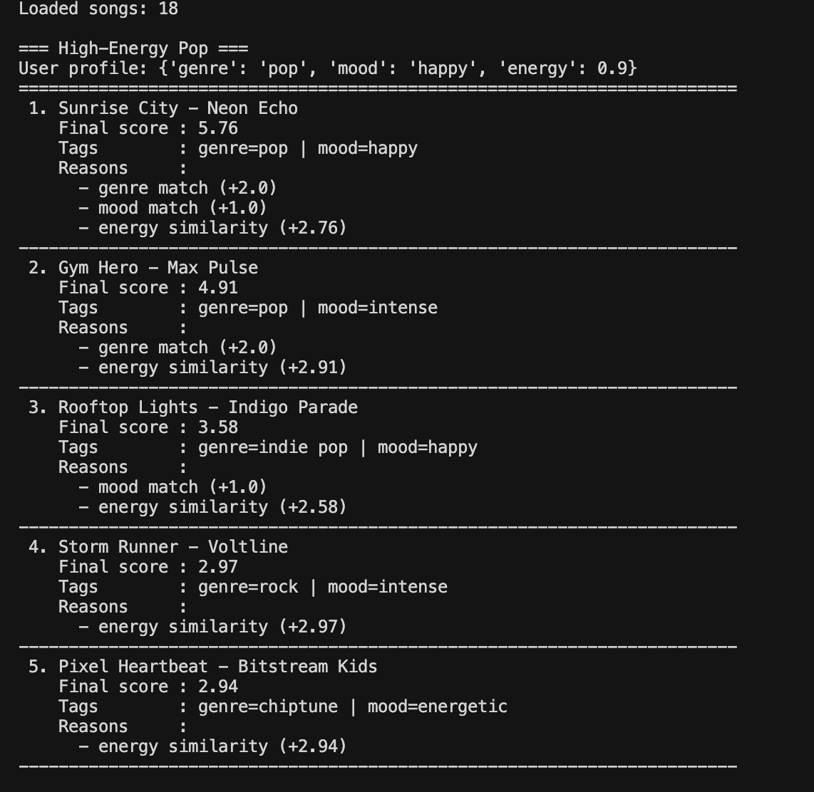
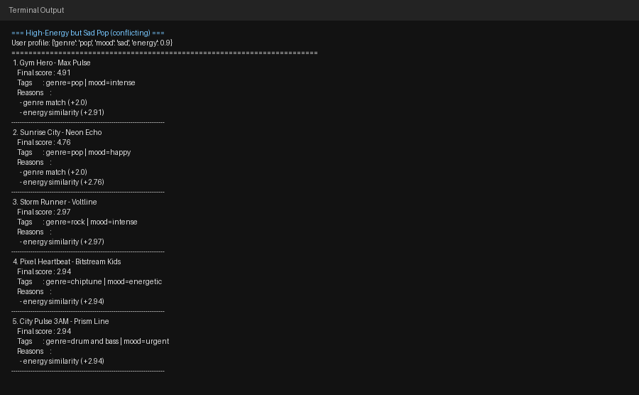
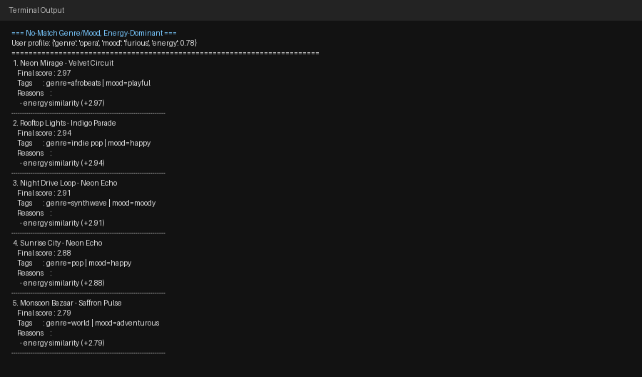
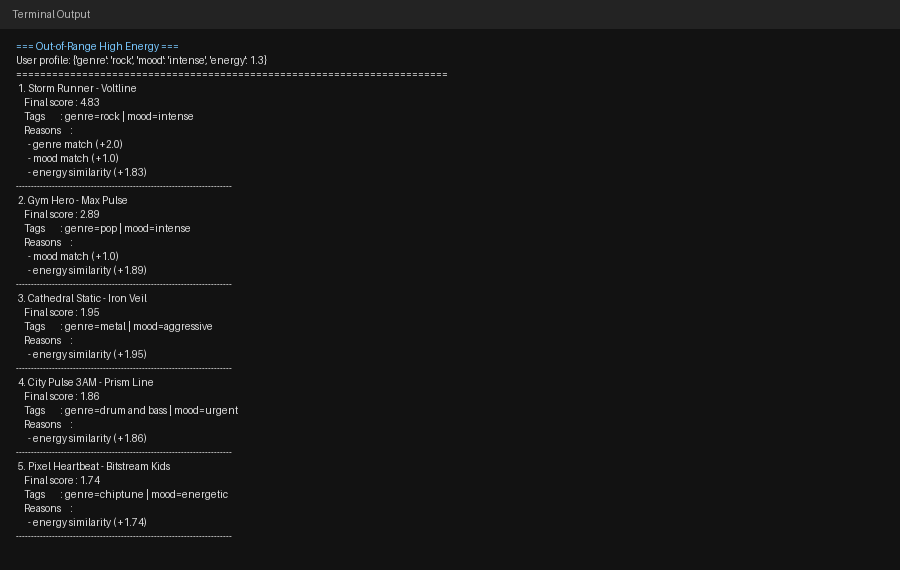
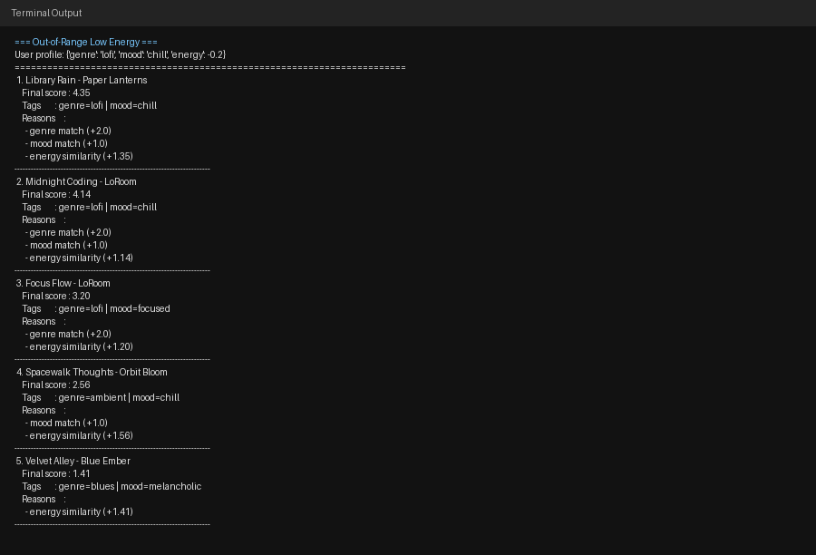
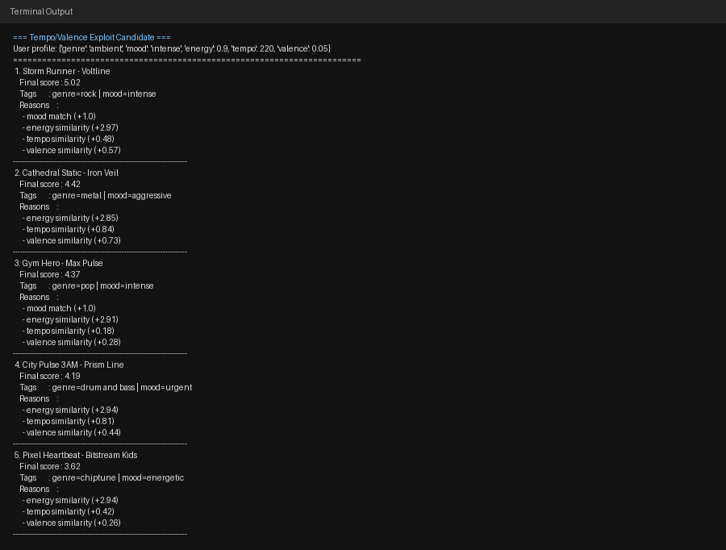

# 🎵 Music Recommender Simulation

## Project Summary

This project builds a transparent music recommender for a small song catalog.
It scores each song against a user profile, ranks results, and returns the top 5 with clear reasons.
I also tested edge cases, added advanced song features, and implemented diversity penalties to reduce repeated artists and genres.

---

## How The System Works

This project uses a transparent, content-based recommender. The system compares each song in `data/songs.csv` to a user's preferences, assigns points using a fixed scoring recipe, and returns the top `k` songs after ranking.

Core features used in this simulation:

- `Song` features: `genre`, `mood`, `energy`, `tempo_bpm`, `valence`, `danceability`, `acousticness`
- `UserProfile` features: preferred `genre`, preferred `mood`, target `energy`, target `tempo_bpm`, target `valence`, target `danceability`, target `acousticness`

Advanced features added:

- `popularity` (0-100)
- `release_decade`
- `mood_tag`
- `vocal_intensity`
- `lyrical_density`
- `live_energy`

### Data Flow (Input -> Process -> Output)

- **Input (User Prefs):** A profile such as `genre`, `mood`, and target `energy` (with optional `tempo` and `valence`).
- **Process (Scoring Loop):** For each song in the CSV, the algorithm calculates a weighted score and records explanation reasons.
- **Output (Ranking):** Songs are sorted by score, then a diversity-aware pass selects the final top `k` recommendations.

### Current Scoring Recipe

For each song, compute:

- `+1.0` point for a **genre match**
- `+1.0` point for a **mood match**
- `+6.0 * max(0, 1 - abs(song_energy - user_target_energy))` for **energy similarity**
- Optional add-ons (if provided): tempo, valence, popularity, decade, mood tags, vocal intensity, lyrical density, and live energy

Then:

1. Sort all songs by base score (highest first).
2. Build top `k` recommendations one-by-one (diversity-aware selection).
3. Apply small diversity penalties during selection:
   - repeated artist: `-1.0` per prior artist occurrence
   - repeated genre: `-0.6` per prior genre occurrence

### Potential Biases and Limitations

- This system may over-prioritize **energy**, causing repeated intense tracks for different high-energy profiles.
- Fixed weights reflect the designer's assumptions, not every listener's true preferences.
- With a small catalog, repeated artists or genres can still dominate even with diversity penalties.
- Content-only scoring ignores listening behavior, context, lyrics, and cultural factors that influence taste.

---


## Getting Started

### Setup

1. Create a virtual environment (optional but recommended):

   ```bash
   python -m venv .venv
   source .venv/bin/activate      # Mac or Linux
   .venv\Scripts\activate         # Windows

2. Install dependencies

```bash
pip install -r requirements.txt
```

3. Run the app:

```bash
python -m src.main
```

### Example CLI Output

The screenshot below shows terminal recommendations with song title, final score, and scoring reasons.



### System Evaluation Screenshots (Adversarial Profiles)

The screenshots below capture the top-5 recommendations for each adversarial profile run from `python -m src.main`.

**High-Energy but Sad Pop (conflicting)**


**No-Match Genre/Mood, Energy-Dominant**


**Out-of-Range High Energy**


**Out-of-Range Low Energy**


**Tempo/Valence Exploit Candidate**


### Running Tests

Run the starter tests with:

```bash
pytest
```

You can add more tests in `tests/test_recommender.py`.

---

## Experiments You Tried

- I tested conflicting and adversarial profiles, including unknown genre/mood and out-of-range energy values.
- I ran a weight-shift experiment by lowering genre importance and increasing energy importance.
- I added advanced song features and observed how richer preferences changed rankings.
- I added diversity penalties to reduce repeated artists/genres in the top results.

---

## Limitations and Risks

- It only works on a tiny catalog.
- It does not learn from listening history or user feedback.
- Strong energy weighting can overpower subtle mood intent.
- Invalid or extreme user inputs can still affect rankings.

For full details, see the [**Model Card**](model_card.md).

---

## Reflection

My biggest learning moment was realizing how sensitive recommendations are to weight changes. When I increased the energy weight, high-energy songs moved up in many profiles, even when mood did not match very well. That showed me how quickly a system can become biased toward one feature if I am not careful with balance.

AI tools helped me test ideas faster by generating edge-case profiles and helping me explain results. I still had to double-check everything by rerunning `python -m src.main` and reading the score reasons in the terminal. I was surprised that such a simple point-based system could still "feel" smart, and next I would improve it by adding input validation, better diversity rules, and more adaptive scoring.

